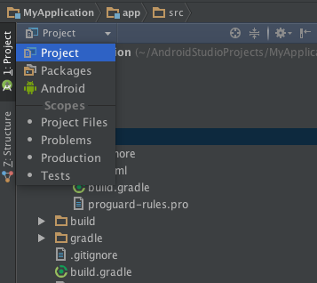

# R.java 在哪裡

## 環境

> OSX Yosemite 10.10.1

> Android Studio 1.1.0

> 日期：2015-03-03

我們在 Eclipse 常常會去看 R.java 中確認資源處理的狀況，但是在 Android Studio 放置 R.java 的位置與 Eclipse 不太一樣

你可以在這裡找到 R.java 檔案

> ./app/build/generated/source/r/debug/`your/packagename/name`/R.java

因為 Android Studio 資料夾顯示方式預設為 `Android`，要選擇 `Project` 才可以看到 `app/build/...` 的資料夾目錄結構

